# Universidade Estácio de Sá

## Curso Análise e Desenvolvimento de Sistemas

### Trabalho da disciplina Programacão para dispositivos móveis em android

### Proposta do projeto

- Aplicativo de Controle de Encomendas para Prédios
  - Este é um aplicativo móvel desenvolvido com React Native e Expo para auxiliar no controle e gerenciamento de encomendas em edifícios residenciais ou comerciais.
  - Ele permite que a portaria registre a entrada de pacotes e que os moradores visualizem e confirmem o recebimento de suas encomendas.

### Apresentação

#### ```Tela Login```

<table>
  <tr>
    <td>
      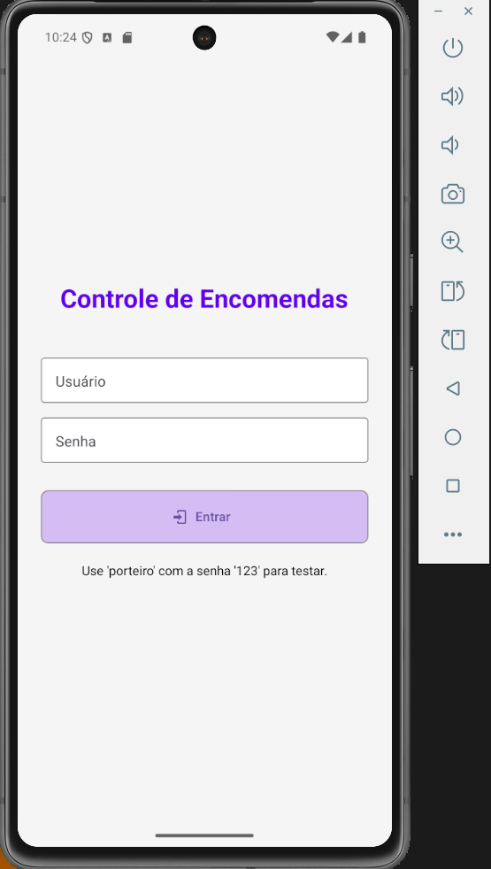
    </td>
    <td>
      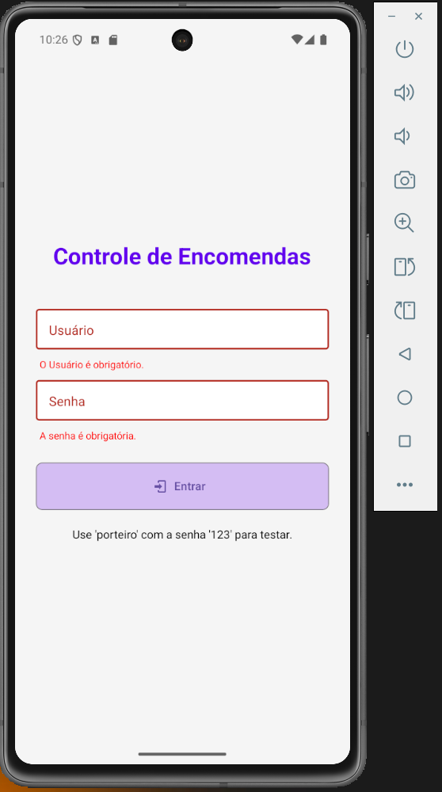
    </td>
  </tr>
</table>

#### ```Tela Registo de Encomendas```

<table>
  <tr>
    <td>
      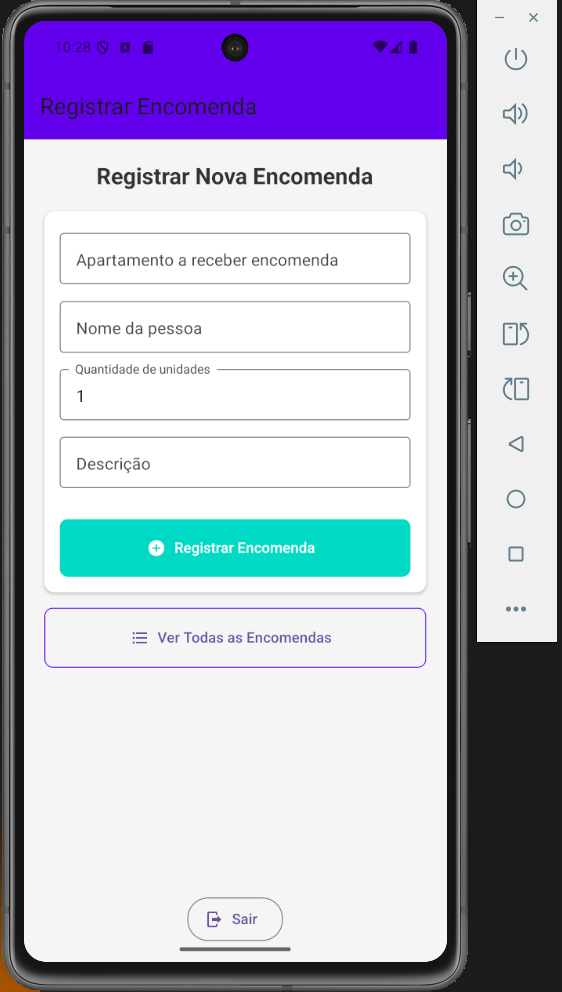
    </td>
    <td>
      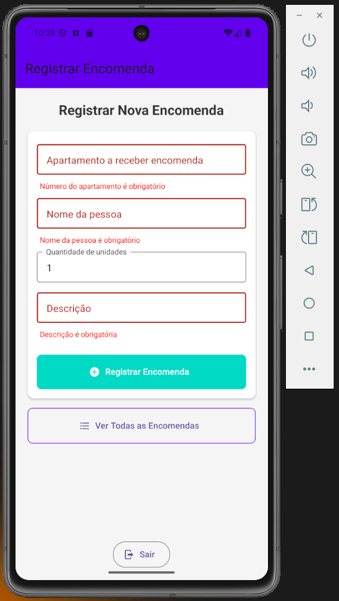
    </td>
    <td>
      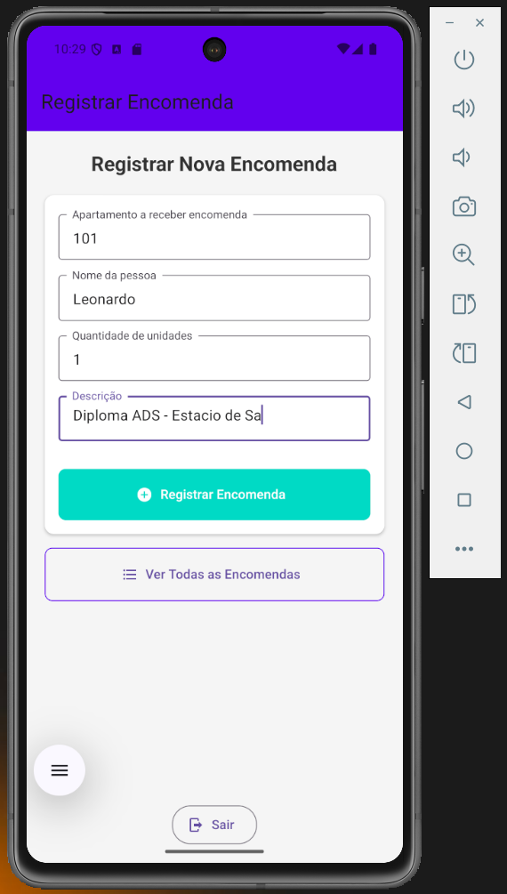
    </td>
    <td>
      
    </td>
  </tr>
</table>
  
#### ```Tela para ver Encomendas```
  
<table>
  <tr>
    <td>
      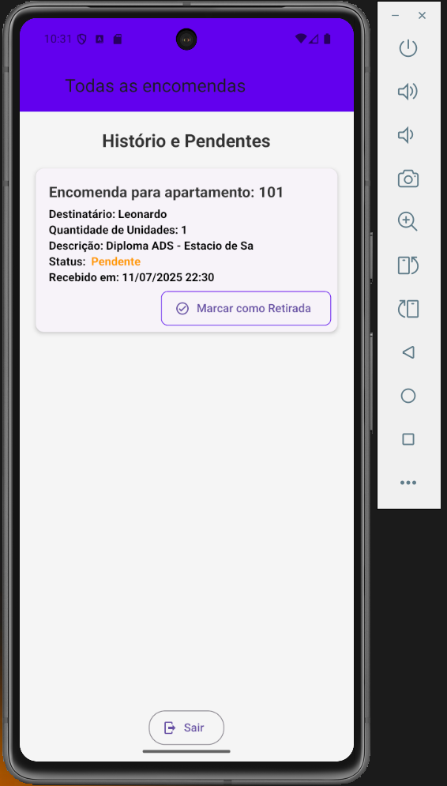
    </td>
    <td>
      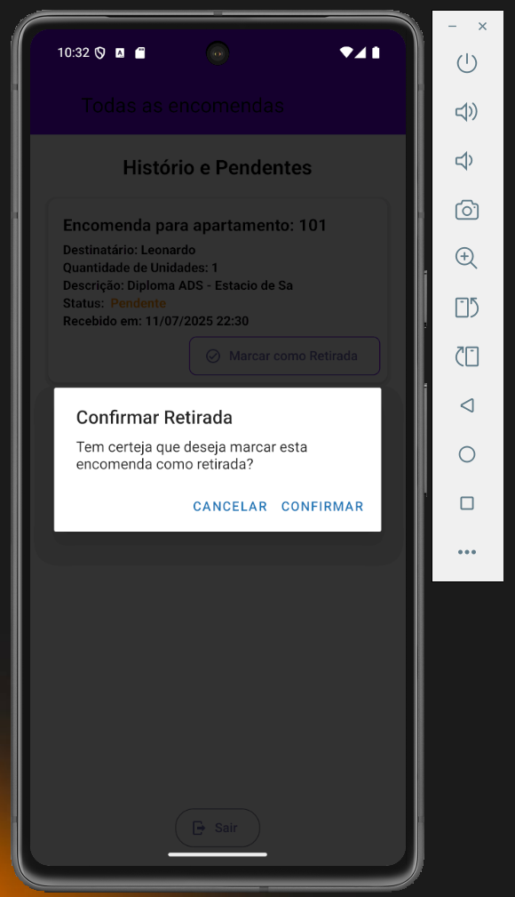
    </td>
    <td>
      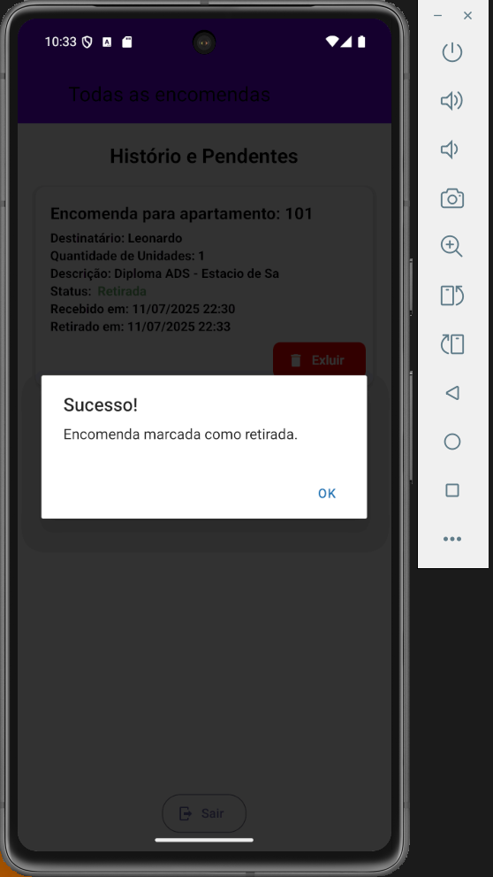
    </td>
    <td>
      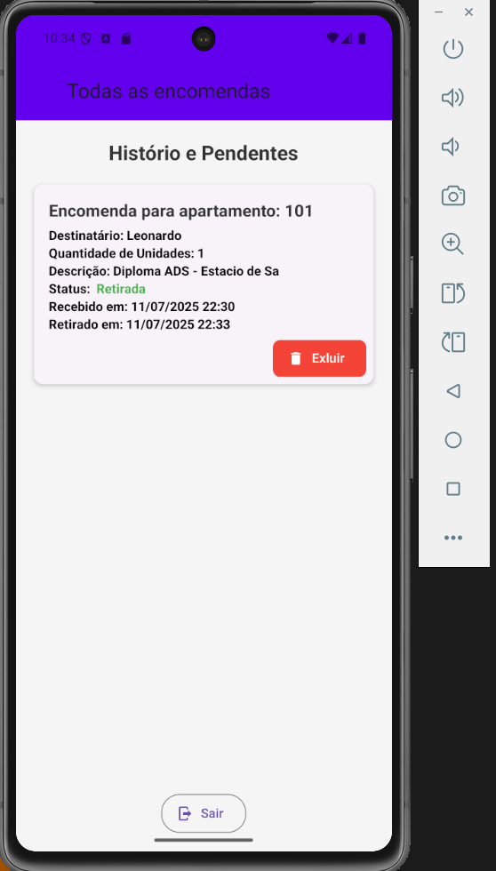
    </td>
  </tr>
</table>

<table>
  <tr>
    <td>
      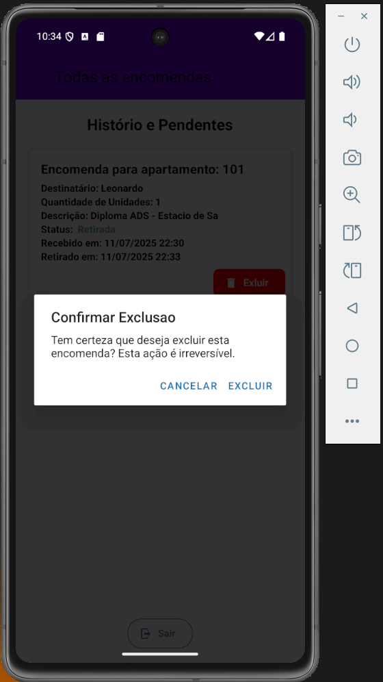
    </td>
    <td>
      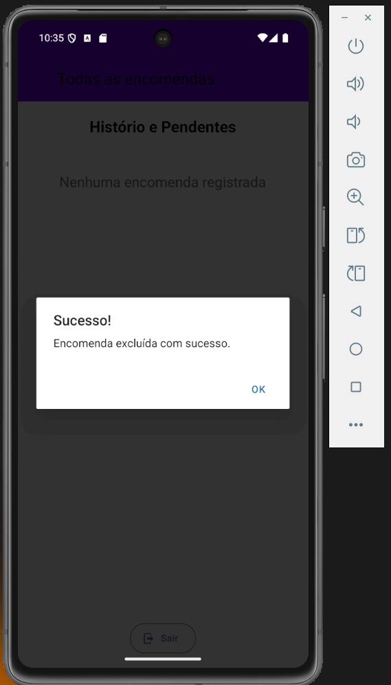
    </td>
    <td>
      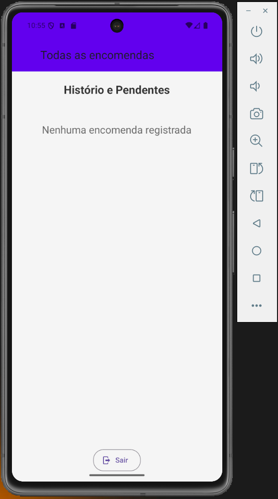
    </td>
  </tr>
</table>

### Funcionalidades

- Autenticação de Usuários:
  - Login para diferentes perfis:
    - Porteiro e Morador.
  
  - Controle de acesso baseado em perfil, direcionando para telas específicas.

- Registro de Encomendas (para Porteiros):
  - Cadastro de novas encomendas com:
    - Número do Apartamento
    - Nome da Pessoa (Destinatário)
    - Quantidade de Unidades
    - Descrição

  - Registro automático de data/hora de recebimento.
  - Status inicial "Pendente".

- Visualização de Encomendas:
  - Porteiros:
    - Podem visualizar uma lista completa de todas as encomendas (pendentes e retiradas).
  
  - Moradores:
    - Podem visualizar apenas as encomendas destinadas à sua unidade.

- Confirmação de Retirada:
  - Moradores podem marcar suas encomendas como "Retirada" diretamente pelo aplicativo.
  - Porteiros também podem alterar o status manualmente.

- Exclusão de Encomendas:
  - Encomendas podem ser excluídas somente após terem o status "Retirada", garantindo um fluxo de controle.

- Persistência de Dados:
  - Utiliza AsyncStorage para armazenar os dados das encomendas localmente no dispositivo, garantindo que as informações não sejam perdidas ao fechar o aplicativo (em um ambiente de simulação sem backend real).

### Tecnologias Utilizadas

- Frontend:
  - Framework para construção de interfaces de usuário nativas:
    - ```React Native```
  
  - Ferramentas e serviços para desenvolvimento simplificado:
    - ```Expo SDK```
  
  - Para persistência de dados local:
    - ```@react-native-async-storage/async-storage```
  
  - Biblioteca de componentes UI com Material Design:
    - ```react-native-paper```
  
  - Para gerenciamento da navegação entre telas:
    - ```@react-navigation/native / @react-navigation/stack```
  
  - Para gerenciamento de formulários e validação de dados:
    - ```formik e yup```

- Arquitetura:
  - MVC (Model-View-Controller):
    - Separação clara de responsabilidades para organização e manutenção do código.

### Estrutura de Pastas

```markdown
my-building-delivery-app/
├── assets/                     # Recursos estáticos da aplicação (imagens, ícones).
├── components/                 # Componentes React reutilizáveis e de menor granularidade.
│   ├── common/                 # Componentes genéricos (ex: Button.js, Input.js).
│   └── delivery/               # Componentes específicos do domínio de "encomendas" (ex: DeliveryCard.js).
├── constants/                  # Valores constantes e configurações globais (cores, papéis de usuário).
├── context/                    # Contextos React para gerenciamento de estado global (ex: AuthContext.js).
├── models/                     # Camada de Model (lógica de dados e interação com armazenamento/API).
│   ├── DeliveryModel.js        # Lógica para gerenciar operações de encomendas (CRUD com AsyncStorage).
│   └── AuthModel.js            # Lógica para autenticação de usuários (simulada).
├── navigation/                 # Configuração da navegação principal da aplicação (AppNavigator.js).
├── screens/                    # Telas principais da aplicação (Views maiores, com sua própria lógica/controllers).
│   ├── Auth/                   # Telas relacionadas à autenticação (LoginScreen.js).
│   └── Deliveries/             # Telas para o gerenciamento e visualização de encomendas (RegisterDeliveryScreen.js, MyDeliveriesScreen.js, AllDeliveriesScreen.js).
├── App.js                      # Ponto de entrada principal do aplicativo.
├── app.json                    # Arquivo de configuração do Expo.
├── package.json                # Lista de dependências do projeto e scripts.
└── README.md                   # Este arquivo de documentação.
```

### Como Rodar o Projeto (Localmente)

- Pré-requisitos:
  - ```Node.js e npm (ou yarn) instalados.```
  - ```Expo CLI instalado globalmente: npm install -g expo-cli```

- Clonar o repositório (se aplicável) ou criar um novo projeto Expo:
  - Clonar o repositório:
    - ```git clone git@github.com:leojosants/universidade_estacio_de_sa_ads__trabalho_disciplina_programacao_para_dispositivos_moveis_em_android.git```
  
  - Criar um novo projeto Expo:
    - ```npx create-expo-app my-building-delivery-app --template blank # ou expo-template-blank-typescript```
- Acessar projeto:
  - ```cd my-building-delivery-app```

- Instalar as dependências:
  - ```npm install @react-native-async-storage/async-storage react-native-paper @react-navigation/native @react-navigation/stack formik yup```

- Organizar os arquivos:
  - Criar as pastas conforme a ```"Estrutura de Pastas"``` acima.

- Iniciar o aplicativo:
  - ```npx expo start -c```
  
  - Isso abrirá o Expo Developer Tools no seu navegador. Você pode então:
    - Escanear o QR code com o aplicativo Expo Go no seu celular.
    - Rodar em um emulador Android ou iOS.
    - Rodar no navegador (algumas funcionalidades nativas podem não funcionar).

### Credenciais de Teste

- Para testar a aplicação, utilize as seguintes credenciais:
  - Porteiro:
    - Usuário: porteiro
    - Senha: 123
  
  - Morador (Unidade 101):
    - Usuário: morador101
    - Senha: 123
  
  - Morador (Unidade 202):
    - Usuário: morador202
    - Senha: 123

### Considerações Importantes

- Persistência de Dados:
  - Os dados são armazenados apenas localmente no dispositivo usando AsyncStorage.

- Segurança:
  - A autenticação é simplificada para fins de demonstração.

### Documentações

- [ReactJs](https://react.dev/)

- [React Native](https://reactnative.dev/docs/getting-started)

- [AsyncStorage](https://reactnative.dev/docs/asyncstorage)

- [Expo](https://expo.dev/)
  
- [Formik](https://github.com/jaredpalmer/formik/blob/main/docs/tutorial.md)
  
- [Yup](https://www.npmjs.com/package/yup)
